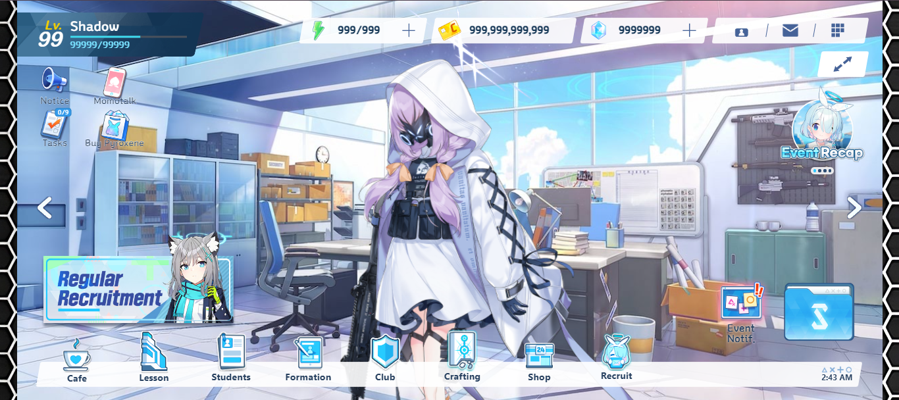

# Blue-Archive-Web (Postponed)
~ Blue Archive Fan Project

**Updated on:** 9 July 2025

### Description
*Blue Archive Web project is a mini version of Blue Archive game with weight load. If you want to play the full and more stable Blue Archive game, you can download it from Google Play Store and App Store. Whereas, on windows you can download at Steam or just use Bluestack, Nox Player, LD Player and others to play it.*

**Deficiency**
* Not responsive: This project build by using laptop screen size, not for any others device.
* Lack of libraries: This project built with few library and make this project lack of abilities

**Libraries (Library will change if project Rebuild or Restructure)**
- Jquery.min.js
- Jquery.html5loader.js
- Pixi.js
- Pixi.spine.js
- Three.js

**Conclution**: This project need more impovement and reconstructure for best user experience

## Disclaimer
**Blue Archive is a registered trademark of NAT GAMES Co., Ltd. This repo is not affiliated with NEXON Korea Corp. & NEXON GAMES Co., Ltd. All game resources are copyrighted to the respective owners.**

## Warning
**These assets cannot be used for things that violate the copyright of NEXON Co., Ltd. as stated below:**
* Infringe the copyright, trademark, database or other intellectual property rights of a third party. You represent and warrant that you own or have all necessary licenses, rights, consents, and permissions to post or transmit the User Content on the Services and that the User Content does not violate any applicable laws, the Terms, or any third party’s right of privacy or publicity.
* Promote unauthorized sweepstakes or contest; and will not promote a lottery, or gambling of any type.
* Prevent or impede other users from finding information related to the Services.
* Facilitate or promote conduct that in the sole discretion of Nexon involves illegal content, pornography, piracy, online pharmacies, illegal drugs, underage drinking, or socially irresponsible behavior due to alcohol or drug consumption (such as drinking and driving).
* Instruct users how to make bombs, weapons, drugs, illegal or illicit or dangerous items, or solicit involvement in behavior or organizations that are violent or illegal under applicable laws, including without limitation terrorist threats or activities.

For more information: https://m.nexon.com/terms/304

**Dev Note**: This project still in development, I'm built it just for fun. Check this out, Nexon just release Blue Archive PC version on Steam, try it.
